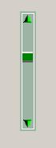

## Graphical VScroll Bar User Control

### Description

i was searhing for VScrollBar that Matches my Project Colors and Style and did find so i mad this one .. its simple to use as normal vScrollBar of microsoft .. if anyonw can also add some modifications on this control to make the MouseDown Event work continuously not like it work now click by click .. it will be nice
 
### More Info
 

             |
---                |---
**Submitted On**   |2009-01-21 04:50:02
**By**             |[Yasser Samir Taha Hassan](https://github.com/Planet-Source-Code/PSCIndex/blob/master/ByAuthor/yasser-samir-taha-hassan.md)
**Level**          |Advanced
**User Rating**    |4.6 (23 globes from 5 users)
**Compatibility**  |VB 6\.0
**Category**       |[Custom Controls/ Forms/  Menus](https://github.com/Planet-Source-Code/PSCIndex/blob/master/ByCategory/custom-controls-forms-menus__1-4.md)
**World**          |[Visual Basic](https://github.com/Planet-Source-Code/PSCIndex/blob/master/ByWorld/visual-basic.md)
**Archive File**   |[Graphical\_2141041212009\.zip](https://github.com/Planet-Source-Code/yasser-samir-taha-hassan-graphical-vscroll-bar-user-control__1-71660/archive/master.zip)

